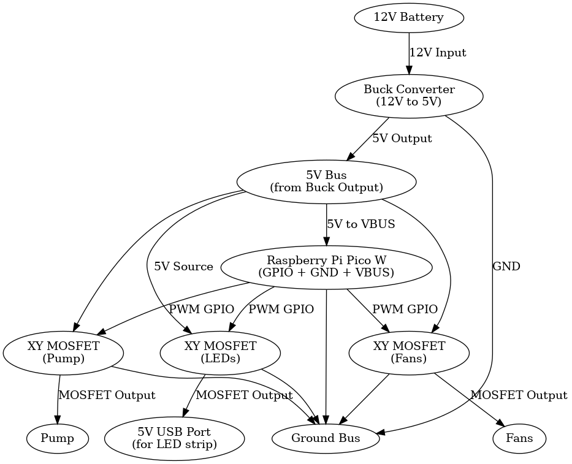

# Smart-Grow-Box

# 🌿 Smart Automated Grow Box

An embedded system designed for automated plant care, integrating environmental sensing, actuator control, and a web-based interface. This project demonstrates practical skills in IoT, microcontroller programming, power management, and responsive system design.

---

## 🔧 Project Overview

The Smart Grow Box automates lighting, watering, and ventilation using real-time sensor data. Built around a Raspberry Pi Pico W, it features:

- Scheduled LED grow lighting
- Soil moisture-based irrigation control
- Time-based and sensor-triggered fan ventilation
- Temperature and humidity monitoring (AHT21 sensor)
- Local web server for live status display and manual override
- Event logging for traceability of all actions

The system is designed for low-power operation using a 12V lithium battery and supports long-term autonomous use.

---

## 🧰 Hardware Used

| Component             | Description                                |
|----------------------|--------------------------------------------|
| Raspberry Pi Pico W  | Microcontroller with Wi-Fi                 |
| XY-MOSFET Modules     | Switch control for LEDs, pump, and fan     |
| 12V Li-ion Battery    | Main power supply                          |
| Buck Converter        | Steps 12V down to 5V for Pico and sensors  |
| AHT21 Sensor          | Temperature and humidity                   |
| Capacitive Soil Sensor| Soil moisture readings                     |
| 5V Water Pump         | Controlled via MOSFET                      |
| 5V Fan                | Runs on timer or humidity logic            |
| USB-powered LEDs      | Grow lights controlled via MOSFET          |
| Flex-sealed Cardboard | DIY housing with lightproof door flap      |

---

## 💻 Technical Highlights

- **Microcontroller:** Raspberry Pi Pico W running MicroPython
- **Web Interface:** Embedded HTTP server with dynamic HTML rendering
- **Power System:** 12V battery with buck converter for regulated 5V supply
- **Sensor Integration:** AHT21 (I2C), capacitive soil moisture sensor (ADC)
- **Actuator Control:** XY-MOSFETs switch pump, fan, and grow lights
- **Data Logging:** In-memory log of sensor readings and events with timestamping via NTP
- **Enclosure:** Light-proof and water-resistant housing with flex-sealed panels and servo-actuated door (in progress)

---

## 📊 Logged Events

Each system action (e.g., lights turning on/off, pump activation) is timestamped and logged along with temperature, humidity, and soil moisture levels. This supports transparency and debugging during extended operation.

---

## 🔌 System Diagram

*Wiring diagram includes power flow, MOSFET control, and sensor pin assignments.*

---

## 🛠️ Skills Demonstrated

- GPIO and ADC programming in MicroPython  
- I2C sensor communication and calibration  
- Socket programming for embedded web server  
- Power supply design and component protection  
- Environmental control loop logic  
- Event handling and time-based scheduling  
- DIY hardware assembly and enclosure design

---

## 🧠 Development Notes

This project was developed as part of a personal portfolio to explore real-world applications of embedded IoT systems. Particular attention was given to:

- Ensuring modular, maintainable code
- Designing a reliable and low-power hardware setup
- Creating a clean, informative web interface
- Planning for future features like LCD display, data persistence, and remote alerting

---

## 📎 Next Steps

- SD card logging or MQTT remote sync
- Servo-controlled light-sealed door
- Long-term power optimization
- Mobile-friendly web UI

---

## 📘 License

MIT License – for learning, growing, and improving 🌱
